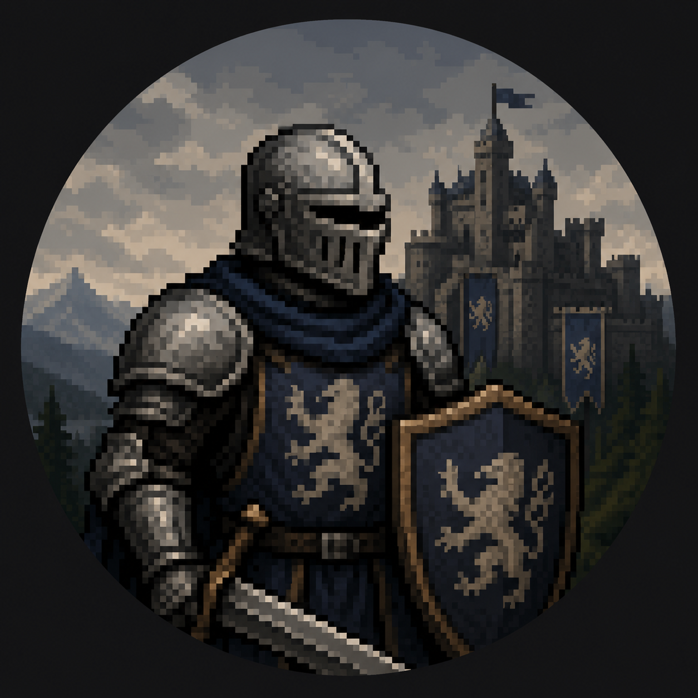

<!--
**Aryasatya-source/Aryasatya-source** is a ✨ _special_ ✨ repository because its `README.md` (this file) appears on your GitHub profile.

Here are some ideas to get you started:

- 🔭 I’m currently working on ...
- 🌱 I’m currently learning ...
- 👯 I’m looking to collaborate on ...
- 🤔 I’m looking for help with ...
- 💬 Ask me about ...
- 📫 How to reach me: ...
- 😄 Pronouns: ...
- ⚡ Fun fact: ...
-->

  

  

<h1 align="center" style="margin-top:8px;">His/Her Majesty The Code Knight</h1>

Knight of the Digital Realm • Architect of Elegant Systems

<blockquote align="center" style="font-style:italic; color:#ddd; border-left: 4px solid #D4AF37; padding:12px 20px; max-width:900px; margin:12px auto;">
"Crafting code like a master blacksmith forging a legendary sword — precision, patience, and purpose in every strike."  
</blockquote>

<!-- ABOUT -->
## 🏰 About the Realm

I travel the digital kingdoms building secure, elegant systems and cinematic experiences. I blend the logic of the forge with the artistry of the court — pragmatic, curious, and ever-learning.

<table width="100%">
  <tr>
    <td width="50%" valign="top">
      <h3>Current Quest</h3>
      <ul>
        <li>Computer science student exploring core programming principlesy</li>
        <li>Deepening core Python programming and data manipulation</li>
        <li>Building responsive and dynamic web interfaces (Front-End)</li>
      </ul>
    </td>
    <td width="50%" valign="top">
      <h3>Guild / Affiliation</h3>
      <ul>
        <li>Kalimantan Institute of Technology</li>
        <!-- <li>Contributor to backend & tooling projects</li> -->
      </ul>
    </td>
  </tr>
</table>

<!-- TECH STACK -->
## 🛡️ Spellbook — Tech Stack

Grouped badges for clean visual alignment. Replace links with your own badge/image hosting if desired.

  <!-- Languages -->
  
  
  
  
  
  <!--  -->

  <!-- Frameworks & Tools -->
  <!--  -->
  
  

  <!-- Multimedia / Design -->
  <!-- 
  
   -->

<!-- GITHUB STATS -->
## 📜 Court Records (GitHub Stats)

  
  
  

## 👾 Play Game With Me
<picture data-importer="pacman">
  <source media="(prefers-color-scheme: dark)" srcset="https://raw.githubusercontent.com/Aryasatya-source/Aryasatya-source/pacman-output/pacman-contribution-graph-dark.svg?game=pacman">
  <source media="(prefers-color-scheme: light)" srcset="https://raw.githubusercontent.com/Aryasatya-source/Aryasatya-source/pacman-output/pacman-contribution-graph.svg?game=pacman">
  
</picture>

###

###

<!-- CONTACT / SOCIAL -->
## ✉️ Message the Court

  
  
  

May your commits be clean, your builds be swift, and your logic unassailable. ⚔️

<!-- FOOTER -->

Theme: Royal / Medieval Fantasy • Colors: deep blue / dark purple / gold • Crafted with ❤️

